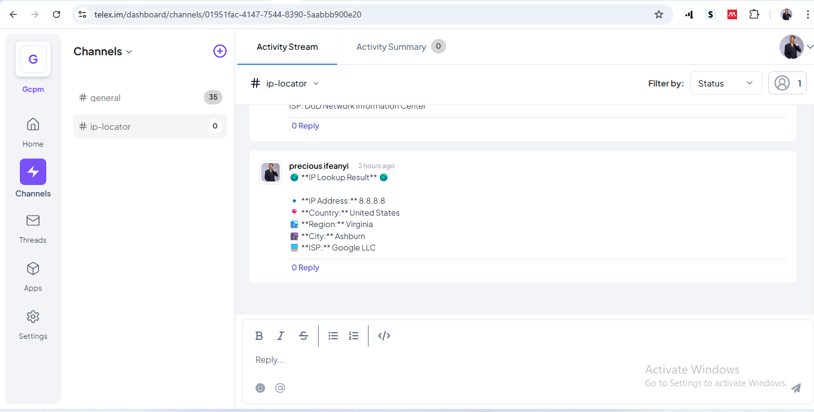

# IP Lookup Telex Integration

## Description
The **IP Lookup Telex Integration** allows users to retrieve geolocation details for any IP address mentioned in their messages. This integration fetches country, city, region, latitude, longitude, and ISP details for a given IP, providing valuable insights directly within Telex.

## Features
- Extracts IP addresses from messages.
- Fetches geolocation details using `ip-api.com`.
- Returns a formatted response with location and ISP information.
- Handles errors for invalid IP addresses and missing messages.

## Installation
### Prerequisites
Ensure you have the following installed:
- [Node.js](https://nodejs.org/) (version 16+ recommended)
- [npm](https://www.npmjs.com/) or [yarn](https://yarnpkg.com/)

### Setup
1. Clone the repository:
   ```sh
   git clone https://github.com/your-username/ip-lookup-telex.git
   cd ip-lookup-telex
   ```
2. Install dependencies:
   ```sh
   npm install
   ```
3. Create an `.env` file in the root directory and configure required environment variables:
   ```sh
   PORT=3000
   ```
4. Start the server:
   ```sh
   npm run dev
   ```

## Usage
Once the server is running, you can interact with the integration via HTTP requests.

### API Endpoints
#### 1. Get Integration Details
**Endpoint:** `GET /integration`

**Response:**
```json
{
  "data": {
    "descriptions": { "app_name": "IP Lookup Telex" },
    "target_url": "/ip-lookup"
  }
}
```

#### 2. Lookup an IP Address
**Endpoint:** `POST /ip-lookup`

**Request Body:**
```json
{
  "channel_id": "12345",
  "message": "Check this IP: 8.8.8.8"
}
```

**Success Response:**
```json
{
  "event_name": "ip_lookup",
  "message": "🌍 IP Lookup Result 🌍\n\n🔹 IP Address: 8.8.8.8  \n📍 Country: United States  \n🏙️ Region: Virginia \n📍 Latitude: 39.03\n📍 Longitude: -77.5\n🌆 City: Ashburn  \n💻 ISP: Google LLC",
  "status": "success",
  "username": "ip-lookup-bot"
}
```

**Error Responses:**
- If `message` is missing:
  ```json
  { "error": "Invalid request. 'message' is required." }
  ```
- If no valid IP is found:
  ```json
  { "event_name": "ip_lookup", "message": "⚠️ No valid IP address found in the message.", "status": "error", "username": "ip-lookup-bot" }
  ```
- If an invalid IP is provided:
  ```json
  { "event_name": "ip_lookup", "message": "⚠️ Invalid IP address: 999.999.999.999", "status": "error", "username": "ip-lookup-bot" }
  ```

## Running Tests
To ensure everything is working correctly, run:
```sh
npm test
```

## Deployment
1. Build the project:
   ```sh
   npm run build
   ```
2. Start the production server:
   ```sh
   npm start
   ```

## Screenshots


--- 

### Contributing
Feel free to fork the repository and submit a pull request with improvements!

### License
This project is licensed under the MIT License.

