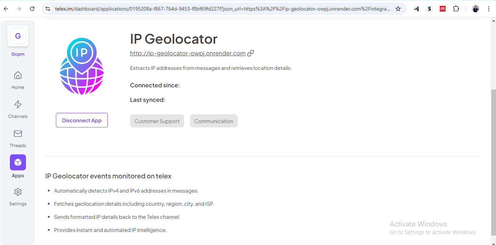

# IP Geolocator Integration

## Description

The **IP Geolocator Integration** is a modifier integration that allows telex users to retrieve geolocation details for any IP address sent to the channel. This integration fetches country, city, region, latitude, longitude, and ISP details for a given IP, providing valuable insights directly within Telex.
Hosted Json: <https://ip-geolocator-owpj.onrender.com/integration>

## What Is Telex?

Telex is an all-in-one monitoring solution for DevOps and software teams, enabling real-time communication and event logging via HTTP webhooks. It supports bulk data ingestion and integrates with platforms like Slack, Discord, and Microsoft Teams for seamless message routing.

Link: <https://telex.im>

## Features

- Extracts IP addresses from messages.
- Fetches geolocation details using `ip-api.com`.
- Returns a formatted response with location and ISP information.
- Handles errors for invalid IP addresses and missing messages.

## Installation

### Prerequisites

Ensure you have the following installed:

- [Node.js](https://nodejs.org/) (version 16+ recommended)
- [npm](https://www.npmjs.com/) or [yarn](https://yarnpkg.com/)

### Setup

1. Clone the repository:

   ```sh
   git clone https://github.com/telexintegrations/ip-geolocator.git
   cd ip-geolocator
   ```

2. Install dependencies:

   ```sh
   npm install
   ```

3. Create an `.env` file in the root directory and configure required environment variables:

   ```sh
   PORT=3000
   ```

4. Start the server:

   ```sh
   npm run dev
   ```

## Usage

Once the server is running, you can interact with the integration via HTTP requests.

### API Endpoints

#### 1. Get Integration Details

**Endpoint:** `GET /integration`

**Response:**

```json
{
  "data": {
    "descriptions": { "app_name": "IP Geolocator" },
    "target_url": "/ip-lookup"
  }
}
```

#### 2. Lookup an IP Address

**Endpoint:** `POST /ip-lookup`

**Request Body:**

```json
{
  "channel_id": "12345",
  "message": "Check this IP: 8.8.8.8"
}
```

**Success Response:**

```json
{
  "event_name": "ip_lookup",
  "message": "🌍 IP Lookup Result 🌍   🔹 IP Address: 8.8.8.8    📍 Country: United States    🏙️ Region: Virginia  📍 Latitude: 39.03   📍 Longitude: -77.5   🌆 City: Ashburn   💻 ISP: Google LLC",
  "status": "success",
  "username": "ip-lookup-bot"
}
```

**Error Responses:**

- If `message` is missing:

  ```json
  { "error": "Invalid request. 'message' is required." }
  ```

- If no valid IP is found:

  ```json
  { "event_name": "ip_lookup", "message": "⚠️ No valid IP address found in the message.", "status": "error", "username": "ip-lookup-bot" }
  ```

- If an invalid IP is provided:

  ```json
  { "event_name": "ip_lookup", 
  "message": "⚠️ Invalid IP address: 999.999.999.999", "status": "error", "username": "ip-lookup-bot" }
  ```

## Running Tests

To ensure everything is working correctly, run:

```sh
npm test
```

## Deployment

1. Choose your platform, build the project:

   ```sh
   npm run build
   ```

2. Start the production server:

   ```sh
   npm start
   ```

## Screenshots




### Contributing

Feel free to fork the repository and submit a pull request with improvements!

### License

This project is licensed under the MIT License.
